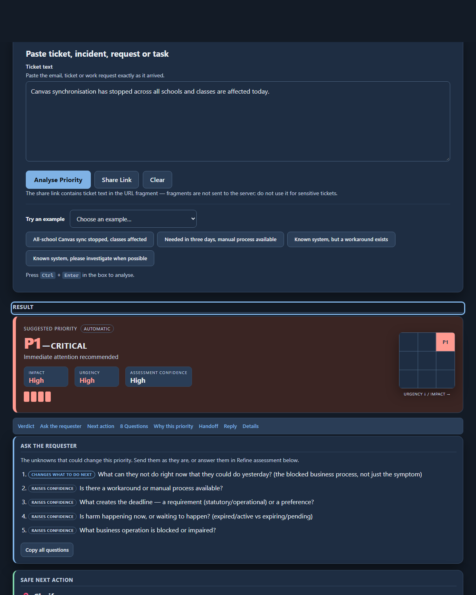
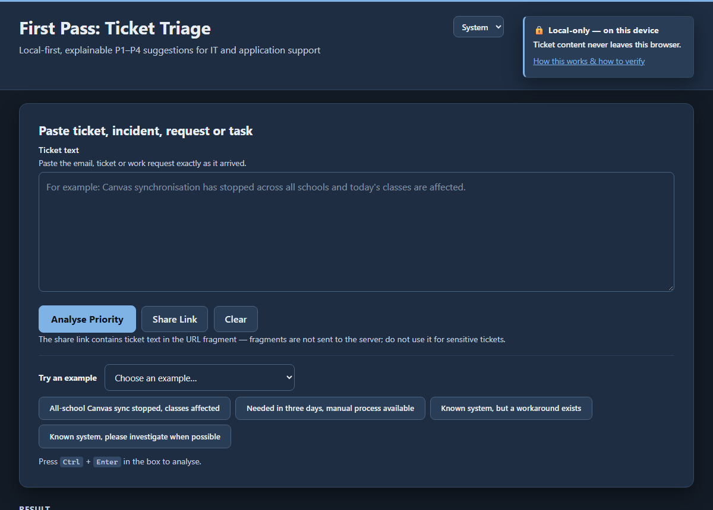
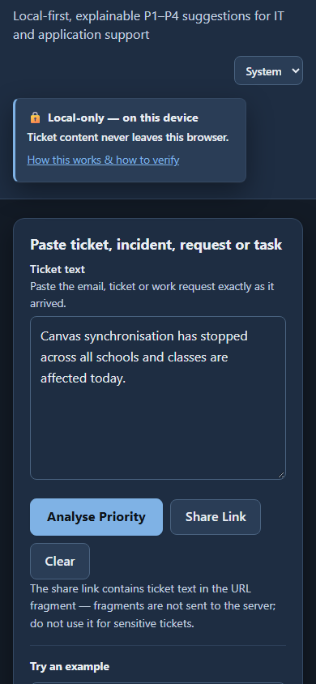

# First Pass: Ticket Triage

> Local-first, explainable P1–P4 suggestions for IT and application support.

[](https://github.com/ikelaiah/first-pass-ticket-triage/actions/workflows/test.yml)
[](https://github.com/ikelaiah/first-pass-ticket-triage/releases/latest)
[](https://github.com/ikelaiah/first-pass-ticket-triage/blob/main/LICENSE)

**Live demo:** <https://ikelaiah.github.io/first-pass-ticket-triage/>

Paste a messy ticket, email or work request. Get a suggested priority, the
evidence behind it, the facts that are missing, and the questions worth asking
next. Everything runs in your browser — no AI provider, no server, no tracking.

Plain HTML, CSS and vanilla JavaScript. No framework, no build step, and no
runtime dependencies.



## 60-second quickstart

1. Open the [live demo](https://ikelaiah.github.io/first-pass-ticket-triage/) — or run it locally (below).
2. Paste a ticket, or press one of the **featured examples**.
3. Select **Analyse Priority**.
4. Read the verdict, then **Ask the requester** for the unknowns that could change it.
5. Answer any you already know in **Refine assessment** — the priority recalculates live.

v0.16.0: **Deployment profile and correctness fixes.** The organisation config is
now a single, replaceable deployment profile (`js/deployment.js`), shown in the
UI footer and documented in [docs/deployment.md](docs/deployment.md). Five audit
fixes: failure-floor attribution, escalated-scope labelling, broader
resolved-incident coverage, and config consistency.

v0.15.0: **Wider recognition, sharper deployment rules.** The generic Pre-K-12
platform catalogue is restored, so the tool names the educational, payroll and
operational platforms tickets refer to. Organisation systems gain shared-instance
blast-radius, sole-instance, and SIS/payroll/payment failure floors.

v0.14.0: **Readable and maintainable.** The pipeline, phrase dictionaries and
result card were split into focused modules; the three re-implemented matchers
now share one helper. No behaviour change.

v0.13.0: **Usable and learnable.** A prominent _Ask the requester_ block with
_Copy all questions_, a sticky jump-to index, a live refine verdict, featured
examples, and accessibility and mobile fixes.

The full contract — every input the priority is calculated from, and the eight
decision questions — is [PRIORITY-FRAMEWORK.md](https://github.com/ikelaiah/first-pass-ticket-triage/blob/main/PRIORITY-FRAMEWORK.md).

| Desktop                                                                 | Mobile                                               |
| ----------------------------------------------------------------------- | ---------------------------------------------------- |
|  |  |

---

## 🔒 Privacy

**Ticket content never leaves the browser.**

All analysis is performed locally using deterministic JavaScript rules. No AI
provider, no server, no analytics, no telemetry, no cookies, no account, no API
key. The application contains no `fetch()`, `XMLHttpRequest`, `WebSocket`,
`sendBeacon` or `EventSource` call, and loads no external font, script or
stylesheet. Ticket text lives in memory only and disappears when you refresh or
close the tab. See [PRIVACY.md](https://github.com/ikelaiah/first-pass-ticket-triage/blob/main/PRIVACY.md) to verify this yourself.

---

## ✨ Features

- **Natural-language ticket input** — paste the request exactly as it arrived
- **Input relevance check** — unrelated text is marked unassessed; urgency and
  scope words alone cannot manufacture an IT incident
- **Deterministic rules** — same text in, same answer out, every time
- **P1–P4 suggestion** driven by a single authoritative 3×3 matrix
- **8 Questions — Impact vs Urgency** — I1 Who/how many? · I2 Blocked process? ·
  I3 Wrong/exposed/lost/unsafe — recoverable? · I4 Contained or spreading? ·
  U5 When needed? · U6 Requirement vs preference? · U7 Workaround cost? ·
  U8 Harm now or waiting? — each shown as Answered / Inferred / Unknown, with
  _key driver_ badges on the unknowns that could flip the cell
- **Ask, don't guess** — an unknown that could change the priority becomes a
  ranked follow-up question instead of an inference
- **Manual refinement** — confirm any question and watch the priority
  recalculate immediately
- **Reasoning chain** — evidence → Impact/Urgency → matrix → P, shown in full
- **Critical-risk safety floor** — payroll, payments, privacy, security, safety,
  safeguarding, data integrity and recoverability
- **Assessment confidence** — a heuristic for how much the ticket actually said,
  clearly labelled as not a probability
- **Safe Next Action** — a separate Clarify / Verify / Investigate / Contain /
  Escalate / Plan advisory; it never changes the suggested priority
- **Triage Handoff** — a compact Known · Unknown · Ask summary with Copy,
  Copy Markdown and Download .md
- **Suggested reply (draft)** — a short requester-facing draft
- **Share link** — `#t=` URL fragment carries the ticket (2000-char cap);
  fragments are not sent to the server, nothing is stored
- **Accessible, offline capable** — semantic HTML, labelled controls, no
  colour-only meaning; works with the network off once downloaded

---

## ⚙️ How it works

```text
Ticket
   ↓
Structured evidence (the eight decision questions)
   ↓  I1 Scope · I2 Blocked process · I3 Risk/recoverability · I4 Containment
   ↓  U5 Deadline · U6 Driver · U7 Workaround · U8 Harm timing
   ↓
Impact + Urgency  (weighted, then a small safety calibration)
   ↓
3×3 Priority Matrix  (the only place a P number is decided)
   ↓
P1 / P2 / P3 / P4  +  confidence · reasoning · missing info · follow-up questions
```

The engine never picks a priority. It establishes **Impact** and **Urgency**;
the safety calibration may raise or lower those two values; only then does the
matrix decide. Safe Next Action, the handoff and the reply are pure projections
that cannot feed back into the priority.

---

## 🚀 Running locally

The application is a static site, but it uses ES modules, so browsers will refuse
to load it directly from `file://`. Serve the folder over HTTP:

```bash
python -m http.server 8000      # Python 3
npx serve .                     # Node
php -S localhost:8000           # PHP
```

Then open <http://localhost:8000>.

On Windows, double-click **`serve.bat`** (a thin wrapper around `serve.ps1`).
The dev server is not part of the application and is not deployed.

### 🧪 Tests and checks

```bash
npm install     # once — dev-only tools (ESLint, Prettier, TypeScript)
npm test        # acceptance suite + privacy source scan
npm run check   # lint + format check + type check + tests
```

The acceptance suite asserts the matrix, each of the eight questions, every
worked example in `js/data/examples.js`, the safety invariants and the advisory
projections. The Node runner also performs a static source scan that fails the
build if any `fetch`, `XMLHttpRequest`, `WebSocket`, `sendBeacon` or remote asset
reference is ever introduced.

Open <http://localhost:8000/tests/tests.html> to run the same suite in a browser.
The dev tools are development-only: the application itself has no dependencies
and no build step.

---

## 📁 Project structure

```text
first-pass-triage/
├── index.html                  entry point and page structure
├── css/styles.css              the only stylesheet
├── js/
│   ├── app.js                  DOM wiring only
│   ├── deployment.js           the active deployment profile (one organisation)
│   ├── engine/
│   │   ├── analyzer.js         the pipeline: evidence → impact/urgency → matrix
│   │   ├── negation.js         normalisation, clause splitting, negation-aware matching
│   │   ├── evidence.js         the evidence ledger (temporal/polarity/authority)
│   │   ├── scope.js            I1  individual … corporation-wide
│   │   ├── symptom.js          what is happening technically
│   │   ├── risks.js            I3  payroll, privacy, security, safety, safeguarding, data integrity
│   │   ├── recoverability.js   I3  recoverable vs unrecoverable loss
│   │   ├── containment.js      I4  contained vs spreading / recurring / unknown
│   │   ├── deadline.js         U5  now … no deadline
│   │   ├── driver.js           U6  requirement or preference
│   │   ├── workaround.js       U7  yes / partial / no / unknown + daily cost
│   │   ├── harm-timing.js      U8  expired vs expiring — harm now or waiting
│   │   ├── impact.js           weighted impact scoring
│   │   ├── urgency.js          weighted urgency scoring
│   │   ├── policy.js           the hard-safety calibration
│   │   ├── confidence.js       how much was actually known
│   │   ├── next-action.js      Safe Next Action advisory
│   │   ├── priority-matrix.js  the authoritative Impact × Urgency table
│   │   ├── decision-context.js   the explicit-resolution rule
│   │   ├── blocked-process.js    I2  blocked / impaired business process
│   │   ├── input-relevance.js    the support-signal boundary
│   │   ├── facets.js             I1–I4/U5–U8 projections for the card
│   │   ├── follow-up-questions.js ranked missing information
│   │   ├── reasoning.js          the reasoning list and one-line justification
│   │   ├── policy-evidence.js    adapter to the policy layer
│   │   ├── next-action-evidence.js adapter to Safe Next Action
│   │   └── overrides.js          manual refinement validation
│   ├── data/
│   │   ├── phrases.js          the phrase-dictionary barrel
│   │   ├── phrases/            one module per facet (scope, urgency, deadline,
│   │   │                       workaround, symptoms, risks, framework, shared)
│   │   ├── systems.js          system detection (profile + generic catalogue)
│   │   ├── platform-catalogue.js  generic Pre-K-12 platform identity
│   │   └── examples.js         the example tickets
│   └── ui/
│       ├── render-result.js    composes the result card
│       ├── render/             banner, ask, chain, eight-questions, projections, panel
│       ├── render-matrix.js    the interactive matrix
│       ├── refine-controls.js  the refinement panel
│       ├── reply.js handoff.js share.js clipboard.js dom.js
├── tests/
│   ├── tests.html              browser test page
│   ├── triage.test.mjs         the acceptance assertions
│   ├── catalogue-coverage.test.mjs  source-inventory reconciliation
│   └── run.mjs                 Node runner + privacy source scan
├── docs/                       developer and user documentation
│   ├── user-guide.md           how to use the tool
│   ├── architecture.md         module map, pipeline and invariants
│   ├── glossary.md             terms (facet, evidence ledger, projection, …)
│   ├── contributing.md         dev setup, checks and pull requests
│   ├── extending.md            add wording, a risk, a facet or an example
│   ├── framework.md            pointer to the priority contract
│   ├── pre-k12-teaching-learning-school-operations-platforms-complete.md
│   │                           the checked-in platform source inventory
│   └── docsprout.json/layout.json  DocSprout (local preview only)
├── serve.bat / serve.ps1       local dev server for Windows (not deployed)
├── eslint.config.js            ESLint (development only)
├── .prettierrc.json            Prettier (development only)
├── tsconfig.json               JavaScript type checking (development only)
├── package.json                scripts and dev-only tooling
├── PRIORITY-FRAMEWORK.md       the authoritative contract
├── PRIVACY.md
└── CHANGELOG.md
```

---

## 📚 Documentation

- [User guide](docs/user-guide.md) — paste, read, ask, refine.
- [Architecture](docs/architecture.md) — how the engine is put together.
- [Glossary](docs/glossary.md) — the vocabulary.
- [Contributing](docs/contributing.md) and [Extending the rules](docs/extending.md).
- [PRIORITY-FRAMEWORK.md](https://github.com/ikelaiah/first-pass-ticket-triage/blob/main/PRIORITY-FRAMEWORK.md) — the authoritative priority contract.

The `docs/` pages are plain Markdown. Preview them locally with
[DocSprout](https://github.com/ikelaiah/docsprout): `pip install` the pinned
release, then run `docsprout serve`. They are not deployed as a site.

---

## 🔧 Configuration

The engine is generic; a **deployment profile** is not. Everything specific to
one organisation lives in
[js/deployment.js](https://github.com/ikelaiah/first-pass-ticket-triage/blob/main/js/deployment.js):
the profile name, school count, and the known systems with their aliases and
deployment facts (`critical`, `soleInstance`, `sharedInstance`, `failureFloor`).

> The checked-in profile describes **the author's employer** — a K-12
> corporation of 19 schools. If you are reusing this tool for a different
> organisation, replace the profile. See
> [docs/deployment.md](docs/deployment.md) for a worked example.

Adding a system or an alias needs no engine changes.

Generic Pre-K-12 platform identity lives separately in
`js/data/platform-catalogue.js`. It is derived from the checked-in source
inventory (`docs/pre-k12-teaching-learning-school-operations-platforms-complete.md`)
and reconciled on every test run by `tests/catalogue-coverage.test.mjs`.
Catalogue identity is recognition and routing context only: platform categories
never contribute to Impact, Urgency or the priority matrix.

---

## 🧩 Extending the rules

- **New wording** → add a phrase to the relevant list in `js/data/phrases.js`.
- **New risk** → add an entry to `RISK_DEFINITIONS`, decide its base evidence
  contribution in `js/engine/impact.js`, and any safety escalation in
  `js/engine/policy.js`.
- **New example** → add it to `js/data/examples.js`.

Base weights live in two small files (`impact.js`, `urgency.js`) and the safety
calibration in `policy.js`, so tuning is a readable diff.

---

## ⚠️ Limitations

- 🤖 **This is not AI.** It is a deterministic phrase and weighting engine. It
  recognises wording; it does not understand your ticket.
- 🧭 **Clarification is a safety feature.** A question the ticket does not answer
  stays Unknown and becomes a follow-up question rather than a guess.
- 💬 **Natural-language understanding is imperfect.** Sarcasm, heavy
  abbreviation and pasted log dumps reduce accuracy.
- 🧑‍⚖️ **It is advisory.** Human judgement, local policy and agreed service
  levels always take precedence.
- 🧠 **It has no memory.** Nothing is stored, so there is no history or learning
  from corrections — by design.
- 🔗 **The share link is the ticket.** It contains the pasted text (first 2000
  characters); do not use it for sensitive tickets.

Queue management is deliberately separate from priority and is not implemented.
Ticket age must not silently increase impact or urgency.

---

## 📄 Licence

[MIT](https://github.com/ikelaiah/first-pass-ticket-triage/blob/main/LICENSE).
